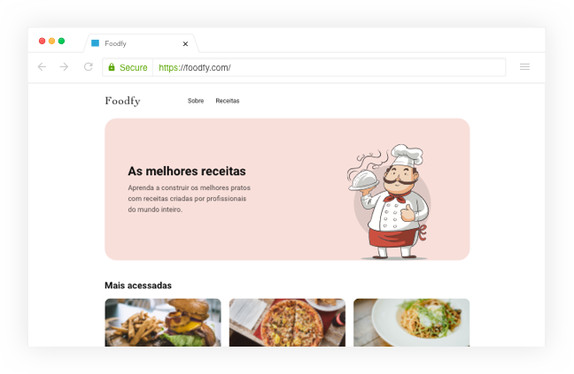

# Launchbase Bootcamp - Fullstack Challenge - Rocketseat

## 🍲 Foodfy - The Project

> Project Foodfy developed during Rocketseat's Bootcamp Launchbase.
> Complete website for a recipe company called Foodfy.

<h1 align="center">
  
</h1>

This is a web project created from scratch.
It was built using as a basis the prototype (`.github/specs/preview`) and the rules of the challenges briefing.
In addition, it was guided by the best practices of Clean Code, BEM CSS, Mobile First, Git Flow and Conventional Commits.

## 💡 Challenges Briefing
- [Challenge 01](https://github.com/JeanneLima/bootcamp-launchbase-desafios-02/blob/master/desafios/02-foodfy.md)
- [Challenge 02](https://github.com/JeanneLima/bootcamp-launchbase-desafios-03/blob/master/desafios/03-refatorando-foodfy.md)


## 📌 Main Technologies

- [HTML](https://developer.mozilla.org/en-US/docs/Web/HTML)
- [CSS](https://developer.mozilla.org/en-US/docs/Web/CSS)
- [Javascript](https://developer.mozilla.org/en-US/docs/Web/JavaScript)
- [Node.js](https://nodejs.org/en/about/)
- [Express](http://expressjs.com)
- [Nunjucks](https://mozilla.github.io/nunjucks/)


## 📂 Installation

Run the following command line on your terminal to clone the project via HTTPS:

```bash
git clone https://github.com/JeanneLima/foodfy.git
```

SSH URLs provide access to a Git repository via SSH, a secure protocol. If you have an SSH key registered in your Github account, clone the project using this command:

```bash
git@github.com:JeanneLima/foodfy.git
```

## 🚀 Running the Project

To run the project in a development environment, just install all the dependencies and start the local server following the next steps:
```bash
npm install
npm start
```

The application will be available in the browser via [http://localhost:5000](http://localhost:5000).

## 📜 License

This project is under the MIT license. See the [LICENSE](https://github.com/JeanneLima/foodfy/blob/develop/LICENSE) file for more details.

Held in December 2021 to January 2022.
Made with 💜 by Jeanne Lima.
[](https://www.linkedin.com/in/jeannecslima/)
